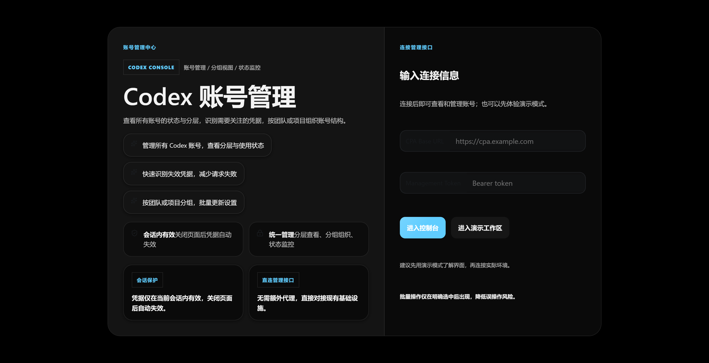
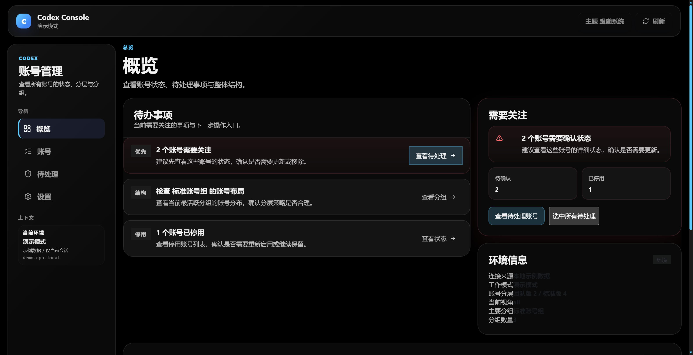
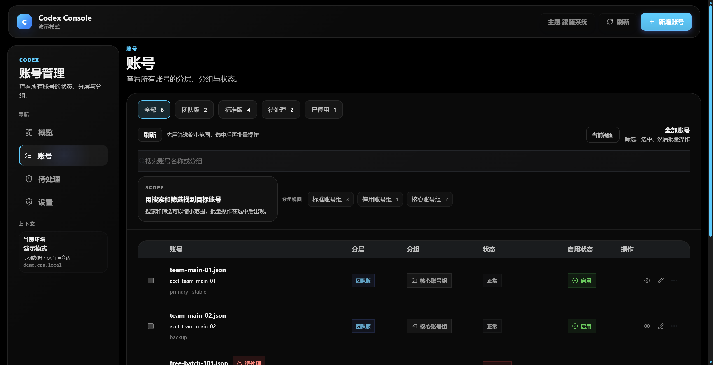

# Codex Operations Console

> ✨ 一个面向运营与支持场景的 Codex 账号控制台前端，强调可读性、批量处理效率与 Fluent 2 风格体验。

[](./LICENSE)
[](https://react.dev/)
[](https://www.typescriptlang.org/)
[](https://vite.dev/)
[](#)

## 🚀 项目简介

Codex Operations Console 是一个基于 `React 19 + Vite + TypeScript` 的前端控制台示例项目，用来集中处理账号状态、分组管理、待清理队列与会话入口。

它的目标不是“再做一个普通后台”，而是提供一套更像系统控制面的工作台体验：

- 🧭 先看当前状态，再做操作决策
- 🗂️ 统一查看 `Team / Free / Cleanup / Disabled` 分层
- ⚡ 支持批量分组、批量禁用、批量删除、待清理标记
- 🌙 提供面向长时间使用的 OLED 深色主题
- 🪟 采用 Fluent 2 风格的卡片、层次与交互反馈

## 🖼️ 项目预览

### 登录页



### 概览页



### 账号页



## 🧩 当前能力

- 登录页支持“演示工作区”与“连接现有空间”两种入口
- 概览页支持关键指标、动态提醒与最近活动摘要
- 账号页支持搜索、筛选、分组、批量操作与详情抽屉
- 清理页支持待处理账号集中审查
- 设置页支持主题切换、空间状态查看与会话重置
- 浏览器直连已有 CPA Management API

## 🛠️ 技术栈

- `React 19`
- `TypeScript`
- `Vite`
- `Vitest`
- `Semi UI`
- `lucide-react`

## 🌟 为什么做这个项目

很多运营后台能“用”，但不一定“好用”。

这个项目关注的不是堆更多模块，而是把下面这些事情做得更顺：

- 📌 重要状态能不能第一眼看出来
- 🧠 批量操作前能不能先建立判断
- 🧭 页面结构能不能让人自然知道下一步去哪
- 🌙 长时间使用时界面会不会太亮、太累、太吵

## ⚙️ 适合什么场景

- 账号管理后台
- OAuth / Token 运维工作台
- 支持团队的运营控制台
- 需要“总览 + 列表 + 批量处理 + 设置”结构的 Web 控制面

## 📦 本地启动

```powershell
npm install
npm run dev
```

默认本地预览地址：

- `http://127.0.0.1:4378/`

## ✅ 质量验证

```powershell
npm test -- --run src/App.test.tsx src/lib/codex.test.ts src/lib/session.test.ts src/lib/theme.test.ts
npm run type-check
npm run build
```

如需补充代码风格检查：

```powershell
npm run lint
```

## 🤖 浏览器审查

项目内置了面向视觉回归与交互复核的文档流程。

- 浏览器测试工作流：`docs/browser-test-workflow.md`
- 多模态审查工作流：`docs/multimodal-review-workflow.md`
- 视觉设计基线：`docs/visual-design-system.md`

## 🧪 当前验证状态

- ✅ `npm run lint`
- ✅ `npm test`
- ✅ `npm run type-check`
- ✅ `npm run build`

说明：

- 当前仓库默认不启用 GitHub Actions CI
- 验证以本地脚本与手动复核流程为主

## 📁 目录结构

```text
.
├─ docs/              # 设计、计划、审查与验证文档
├─ public/            # 静态资源
├─ scripts/           # 辅助脚本
├─ src/
│  ├─ components/     # 复用组件
│  ├─ data/           # 演示数据
│  ├─ lib/            # 纯逻辑与工具函数
│  ├─ pages/          # 页面入口
│  ├─ services/       # API 访问层
│  ├─ test/           # 测试初始化
│  └─ types/          # 类型定义
└─ README.md
```

## 🎨 设计原则

这个项目优先遵循以下方向：

- 让复杂运营动作拥有更稳定的视觉层级
- 让关键状态与风险提示比“装饰”更先被看到
- 避免后台模板感，靠结构与材质感建立控制面气质
- 在深色和浅色主题下都保持清晰、克制、耐看

相关文档：

- `docs/visual-design-system.md`
- `docs/frontend-optimization-summary.md`
- `docs/p0-fixes-report.md`

## 🗺️ Roadmap

- [x] 建立可运行的 React + Vite + TypeScript 控制台骨架
- [x] 完成演示工作区、总览、账号、清理、设置等核心页面
- [x] 补齐单元测试、类型检查和构建验证
- [x] 收口公开仓库边界，完成 GitHub public 发布
- [ ] 补充更完整的空状态与异常状态设计
- [ ] 继续优化表格密度与大数据量场景体验
- [ ] 提供更标准化的 API mock / demo 数据切换方式
- [ ] 视情况补充在线演示或 Storybook

## ❓ FAQ

### 这是完整产品吗？

不是。它目前更接近“高完成度前端控制台原型 + 可继续演进的开源仓库”。

### 可以直接用于生产吗？

可以作为前端基础继续演进，但仍建议根据你的真实 API、权限模型和部署环境做二次收口。

### 为什么没有放部署信息？

因为这个仓库按公开源码仓库设计，敏感部署信息、服务器入口和运行细节不应出现在这里。

### 为什么没有开启 GitHub CI？

当前选择是保持仓库轻量，使用本地验证命令和手动审查流程；后续如果协作规模扩大，可以再引入 CI。

## 🔐 安全边界

这个仓库面向公开源码管理，默认不包含任何敏感部署信息。

- 不提交真实令牌、私钥、环境密钥或生产配置
- 不提交私有部署入口、服务器凭据或运行密文
- 所有敏感部署与运行信息应保存在私有 server 控制面工作区，而不是本仓库

## 🧱 开发约定

- 推荐 Node.js `22`
- 推荐使用 `npm ci` 保持依赖安装一致性
- 代码提交前至少运行 lint、test、type-check、build
- UI 改动建议附截图
- 不要把真实凭据、环境变量或私有部署说明提交进仓库

## 🤝 参与贡献

欢迎通过 Issue 和 Pull Request 一起完善这个项目。

- 提交问题前，请先确认是否已有相似 Issue
- 提交 PR 前，请先运行测试、类型检查和构建
- 涉及视觉改动时，建议附带截图或说明影响范围

更多协作约定见：

- `CONTRIBUTING.md`
- `SECURITY.md`
- `.github/pull_request_template.md`

## 🙌 致谢

这个项目的设计与实现受到以下方向启发：

- Microsoft Fluent 2 的系统感与材质层次
- 深色界面的 OLED 友好设计实践
- 真实运营后台对密度、层级与批量处理的要求

## 📜 开源许可

本项目采用 `MIT License`。

详见：

- `LICENSE`
